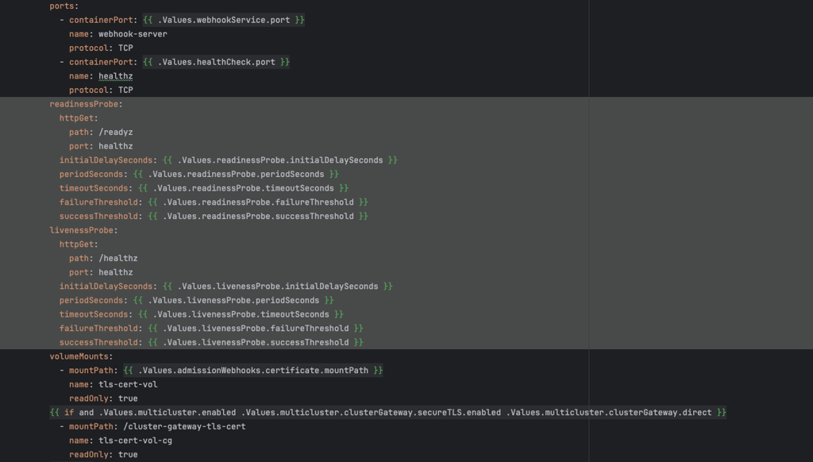

# Remote Debugging KubeVela Applications

This guide provides comprehensive instructions for configuring remote debugging of KubeVela applications using IntelliJ IDEA or VS Code. It outlines the essential configurations and provides a step-by-step process for attaching the debugger to a KubeVela application running within a Kubernetes cluster. This setup empowers developers to examine application behavior, identify issues, and enhance performance by directly interacting with the runtime environment.

## Prerequisites

Before you begin, ensure you have:

- KubeVela source code cloned from [github.com/kubevela/kubevela](https://github.com/kubevela/kubevela)
- [Go 1.19](https://go.dev/dl/) or later installed
- A running Kubernetes cluster accessible via `~/.kube/config`
- Docker installed for building container images
- Access to a container registry (e.g., Docker Hub)
- An IDE with Go debugger support (VS Code or IntelliJ IDEA / GoLand)
- [Delve](https://github.com/go-delve/delve) debugger (will be installed in the container)

:::note
For local debugging without containers, see [Debugging KubeVela Controllers](./debugging-kubeVela-controllers.md).
:::

## Overview

Remote debugging allows you to debug a KubeVela application running inside a Kubernetes pod. This approach is useful when you need to debug issues that only occur in a cluster environment. The setup involves:

1. Building a debug-enabled Docker image with Delve
2. Modifying the deployment configuration
3. Deploying the debug image to your cluster
4. Attaching the remote debugger from your IDE

## Step 1: Update the Dockerfile for Remote Debugging

Modify the `Dockerfile` in the root of the KubeVela repository to enable remote debugging.

### Install the Delve Debugger During the Build Stage

Add the following command to install Delve (ensure the version matches your Go version):

```dockerfile
RUN go install github.com/go-delve/delve/cmd/dlv@v1.22.0
```

:::info
This installs Delve, the Go debugger, which enables remote debugging and allows IntelliJ IDEA or VS Code to interact with your running application.
:::

### Modify the Build Command

**Original Command:**

```dockerfile
RUN GO111MODULE=on CGO_ENABLED=0 GOOS=linux GOARCH=${TARGETARCH} \
    go build -a -ldflags "-s -w -X github.com/oam-dev/kubevela/version.VelaVersion=${VERSION:-undefined} -X github.com/oam-dev/kubevela/version.GitRevision=${GITVERSION:-undefined}" \
    -o manager-${TARGETARCH} cmd/core/main.go
```

**Updated Command:**

```dockerfile
RUN GO111MODULE=on CGO_ENABLED=0 GOOS=linux GOARCH=${TARGETARCH} \
    go build -gcflags="all=-N -l" -a -ldflags "-X github.com/oam-dev/kubevela/version.VelaVersion=${VERSION:-undefined} -X github.com/oam-dev/kubevela/version.GitRevision=${GITVERSION:-undefined}" \
    -o manager-${TARGETARCH} cmd/core/main.go
```

**Key Changes:**

- **Added:** `-gcflags="all=-N -l"` - Disables optimizations and inlining, preserving debugging information
- **Removed:** `-s -w` flags from ldflags - These strip symbol tables and debug information

### Expose the Debugger Port

Add the following line to expose the debugger port:

```dockerfile
EXPOSE 40000
```

:::info
Port 40000 is the default port for Delve. You can use any port, but ensure consistency across all configurations.
:::

### Copy the Delve Binary into the Runtime Container

Add this line to copy the Delve binary to the runtime container:

```dockerfile
COPY --from=builder /go/bin/dlv /
```

This makes the debugger available during runtime.

### Build and Push the Docker Image

Build your Docker image with a designated tag and push it to your container registry:

```bash
docker build -t <docker-hub-username>/kubevela:debug -f Dockerfile .
docker push <docker-hub-username>/kubevela:debug
```

Replace `<docker-hub-username>` with your actual Docker Hub username or registry path.


## Step 2: Modify the kubevela-controller.yaml

Edit the file `charts/vela-core/templates/kubevela-controller.yaml` to make the following changes:

### Remove Leader Election

Remove the `--enable-leader-election` argument from the `spec.containers.args` section in the deployment manifest.

:::warning
Leader election ensures high availability by keeping only one active controller instance. During debugging, breakpoints can pause the pod for extended periods, potentially triggering restarts. Disabling leader election prevents this interruption during debugging sessions.
:::


### Update the Deployment Image

In the deployment manifest, find the `spec.containers.image` section and update it with your debug image:

```yaml
image: <docker-hub-username>/kubevela:debug
```

Ensure you use the same image name and tag specified during the `docker push` command.


### Remove Readiness and Liveness Probes

Disable the readiness and liveness probes by removing both the `readinessProbe` and `livenessProbe` sections under `spec.containers` in the deployment manifest.

:::info
Disabling probes prevents Kubernetes from restarting the pod when it becomes unresponsive during debugging. Breakpoints can cause the application to halt, leading to probe failures and unwanted restarts.
:::


## Step 3: Deploy KubeVela Core to Your Kubernetes Cluster

Navigate to the root directory of the KubeVela repository and execute the following Helm command:

```bash
helm upgrade --install --create-namespace --namespace vela-system \
  --set image.pullPolicy=IfNotPresent \
  --set image.repository=<docker-hub-username>/kubevela \
  --set image.tag=debug \
  --set applicationRevisionLimit=5 \
  --set controllerArgs.reSyncPeriod=1m \
  --set optimize.disableComponentRevision=false \
  --set multicluster.clusterGateway.image.repository=ghcr.io/oam-dev/cluster-gateway \
  --set admissionWebhooks.patch.image.repository=ghcr.io/oam-dev/kube-webhook-certgen/kube-webhook-certgen \
  --wait kubevela ./charts/vela-core --debug
```

:::tip
The `--wait` flag ensures the command pauses until all resources are ready, while `--debug` provides detailed output for troubleshooting.
:::

### Verify the Deployment

After successful execution, verify the status:

```bash
kubectl get all -n vela-system
```

**Expected Output:**

```
NAME                                            READY   STATUS    RESTARTS   AGE
pod/kubevela-cluster-gateway-7b8d9cb47d-wbz44   1/1     Running   0          50s
pod/kubevela-vela-core-7f96576fcd-tqsq2         1/1     Running   0          50s

NAME                                       TYPE        CLUSTER-IP      EXTERNAL-IP   PORT(S)    AGE
service/kubevela-cluster-gateway-service   ClusterIP   10.43.197.61    <none>        9443/TCP   30s
service/vela-core-webhook                  ClusterIP   10.43.220.182   <none>        443/TCP    30s

NAME                                       READY   UP-TO-DATE   AVAILABLE   AGE
deployment.apps/kubevela-cluster-gateway   1/1     1            1           29s
deployment.apps/kubevela-vela-core         1/1     1            1           29s

NAME                                                  DESIRED   CURRENT   READY   AGE
replicaset.apps/kubevela-cluster-gateway-7b8d9cb47d   1         1         1       50s
replicaset.apps/kubevela-vela-core-7f96576fcd         1         1         1       50s
```

Once the Vela core is running, proceed to attach the debugger.

### Uninstalling KubeVela

To remove KubeVela from the cluster:

```bash
helm delete kubevela --namespace vela-system --debug
```

## Step 4: Attach the Go Delve Debugger to the Vela Core Pod

Attach the Delve debugger to the running Vela Core pod:

```bash
kubectl exec -it pod/<pod_name> -n vela-system -- /dlv attach 1 --headless --listen=:40000 --api-version=2 --accept-multiclient
```

Replace `<pod_name>` with your actual pod name (e.g., `kubevela-vela-core-7f96576fcd-tqsq2`).

**Command Breakdown:**

- `dlv attach <PID>` - Attaches to the Go process with the specified Process ID (PID 1 is typically the main process)
- `--headless` - Runs Delve in headless mode (no interactive terminal)
- `--listen=:40000` - Listens on port 40000 for remote connections
- `--api-version=2` - Uses Delve API version 2
- `--accept-multiclient` - Allows multiple debugger clients to connect

**Expected Output:**

```
API server listening at: [::]:40000
2025-02-23T17:11:52Z warning layer=rpc Listening for remote connections (connections are not authenticated nor encrypted)
```

:::warning
The debugger warns that connections are not authenticated or encrypted. Only use this in trusted development environments.
:::

## Step 5: Enable External Access to the Debugger Port

For local clusters (e.g., K3d, minikube), forward the debugger port to your local machine:

```bash
kubectl port-forward pod/<pod_name> -n vela-system 40000:40000
```

Replace `<pod_name>` with your actual pod name.

**Expected Output:**

```
Forwarding from 127.0.0.1:40000 -> 40000
Forwarding from [::1]:40000 -> 40000
```

:::important
Run this port forwarding command in a **separate terminal** as it's a continuous process. Closing the terminal will terminate port forwarding.
:::

## Step 6: Configure Remote Debugging in Your IDE

### VS Code Configuration

Create or update `.vscode/launch.json` in your project root:

```json
{
  "version": "0.2.0",
  "configurations": [
    {
      "name": "Attach to Remote KubeVela",
      "type": "go",
      "request": "attach",
      "mode": "remote",
      "host": "localhost",
      "port": 40000
    }
  ]
}
```

To start debugging:
1. Open the Run and Debug view (Ctrl+Shift+D / Cmd+Shift+D)
2. Select "Attach to Remote KubeVela" from the dropdown
3. Click the green play button or press F5

### IntelliJ IDEA / GoLand Configuration

1. **Open Run/Debug Configurations:**
   - Navigate to `Run > Edit Configurations`

2. **Add a New Configuration:**
   - Click the plus icon (+) and select `Go Remote`

3. **Configure Connection Settings:**
   - **Name:** `Remote Debug KubeVela`
   - **Host:** `localhost` (or the hostname where your cluster is accessible)
   - **Port:** `40000`

4. **Save and Launch:**
   - Click `Apply` and then `OK`
   - Select your configuration and click the Debug button (Shift+F9)


Once connected, you'll see a message in the port forwarding terminal indicating active connections on port 40000.


## Step 7: Debug with Breakpoints

### Set a Breakpoint

1. Open a source file in your IDE (e.g., `pkg/webhook/core.oam.dev/v1beta1/componentdefinition/validating_handler.go`)
2. Click in the gutter next to a line number to set a breakpoint
3. The breakpoint will be marked with a red dot

### Trigger the Breakpoint

Create a test manifest to trigger your breakpoint. For example, create `component.yaml`:

```yaml
apiVersion: core.oam.dev/v1beta1
kind: ComponentDefinition
metadata:
  name: configmap-component
spec:
  workload:
    definition:
      apiVersion: v1
      kind: ConfigMap
  schematic:
    cue:
      template: |
        parameter: {
          firstkey: string
          secondkey: string
        }
        output: {
          apiVersion: "v1"
          kind:       "ConfigMap"
          metadata: {
            name: context.name
          }
          data: {
            firstkey: parameter.firstkey
            secondkey: parameter.secondkey
            data: "10"
          }
        }
```

Apply the manifest:

```bash
kubectl apply -f component.yaml
```

### Observe the Debug Session

When execution reaches your breakpoint:
- The IDE will pause at the breakpoint line
- You can inspect variables, evaluate expressions, and step through code
- Use standard debugging controls (Continue, Step Over, Step Into, Step Out)


:::caution
Do not modify the source code while debugging. The running container was built from the current source, and changes can cause the debugger to behave abnormally or lose synchronization.
:::

## Troubleshooting

### Debugger Won't Connect

- Verify port forwarding is active and running in a separate terminal
- Check that the Delve process is running in the pod
- Ensure firewall rules allow connections to port 40000

### Breakpoints Not Hit

- Confirm the source code matches the deployed binary
- Verify the code path is actually being executed
- Check that optimizations were disabled during build (`-gcflags="all=-N -l"`)

### Pod Restarts During Debugging

- Ensure you removed the `--enable-leader-election` flag
- Verify readiness and liveness probes are disabled
- Check pod logs for crash reasons: `kubectl logs <pod_name> -n vela-system`

## Best Practices

1. **Use a Dedicated Debug Cluster:** Avoid debugging in production or shared environments
2. **Tag Debug Images Clearly:** Use tags like `:debug` to distinguish from production images
3. **Restore Production Settings:** Remember to re-enable leader election and probes for production deployments
4. **Clean Up:** Remove debug images and configurations after debugging sessions

## References

- [Delve Debugger Documentation](https://github.com/go-delve/delve/tree/master/Documentation)
- [Debugging a Go Application Inside a Docker Container](https://blog.jetbrains.com/go/2020/05/06/debugging-a-go-application-inside-a-docker-container/)
- [Attach to Running Go Processes with Debugger](https://www.jetbrains.com/help/go/attach-to-running-go-processes-with-debugger.html)
- [VS Code Go Debugging](https://github.com/golang/vscode-go/wiki/debugging)

## Next Steps

- Learn about [Debugging KubeVela Controllers](./debugging-kubeVela-controllers.md) for local debugging
- Explore [Debugging with Webhook Integration](./debugging-kubevela-with-webhook.md) for webhook debugging
- Check the [KubeVela Contributor Guide](../../contributor/overview) for more development resources

